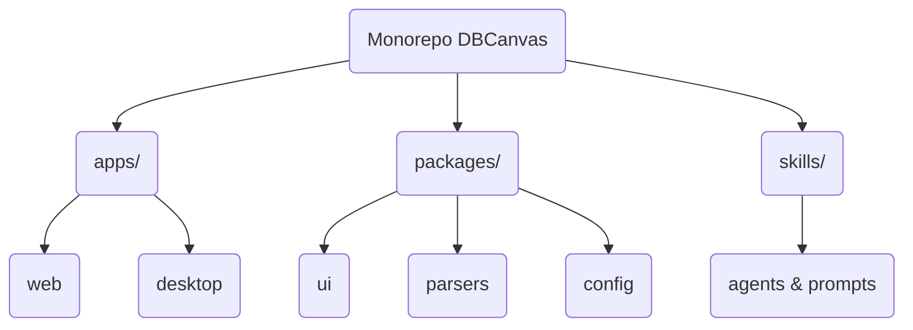
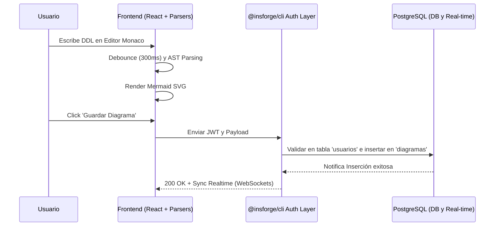
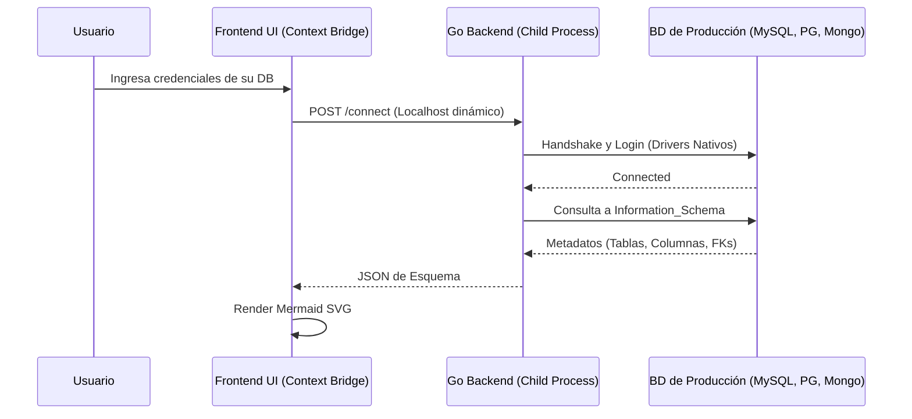

# Informe de Arquitectura de Software (FD04)

**Sistema *DBCanvas — Database Diagram Generator***

| CONTROL DE VERSIONES | | | | | |
| :-: | :- | :- | :- | :- | :- |
| Versión | Hecha por | Revisada por | Aprobada por | Fecha | Motivo |
| 1.0 | KHZM / JAVE | | | Abril 2026 | Versión Original |

***

## 1. Introducción

### 1.1 Propósito
Este documento proporciona una visión global de la arquitectura del sistema **DBCanvas**, detallando las decisiones de diseño estático y dinámico. Está destinado a guiar el trabajo de los desarrolladores permitiendo entender cómo las diferentes partes móviles (React, Electron, Go, y PostgreSQL Cloud) se comunican e interactúan bajo el patrón general de arquitectura.

### 1.2 Alcance
Se describen las arquitecturas de red, los estilos arquitectónicos aplicados (Monorepo), el diseño del flujo en Web y Desktop, y la estrategia de base de datos en nube usando mecanismos de sincronización en tiempo real.

***

## 2. Representación Arquitectónica

El proyecto implementa la abstracción de **arquitectura de software Monorepo** usando `Turborepo` / `pnpm workspaces`. Esta estructura alberga múltiples aplicaciones bajo un solo árbol de dependencias, lo cual facilita compartir lógica, interfaces y UI.

A su vez, el producto final deriva en dos patrones:

1. **Arquitectura Cliente-Servidor Desacoplada (WebApp):** El frontend (React) ejecuta `parsers` locales en TypeScript. Cuando requiere operaciones de persistencia o tiempo real, se comunica a través de peticiones HTTP REST y WebSockets con su Backend as a Service montado sobre un servidor PostgreSQL administrado por `@insforge/cli`.
2. **Arquitectura de Micro-servicios Locales en IPC (Desktop App):** Electron levanta la misma UI de React, pero engendra ("spawns") un subproceso local compilado en `Go` que sirve como puente de conectividad con los verdaderos servidores de base de datos del usuario, eliminando la necesidad de salidas a internet.

***

## 3. Metas y Restricciones Arquitectónicas

- **Sin Dependencia Extendida (Vendor Lock-in):** Para el registro y persistencia, si bien se emplea el auth de las herramientas CLI (`@insforge/cli`), se ha dispuesto que el sistema guarde espejos directos de identidad y credenciales hash en la tabla `usuarios` para ser 100% dueños del esquema PostgreSQL.
- **Portabilidad (Standalone):** El binario en Go asociado a Electron debe poder compilarse para `linux-amd64`, `windows-amd64` y `darwin-arm64` sin requerir que los usuarios tengan la runtime de Go instalada.

***

## 4. Vista Lógica / Diagramas de Componentes

### 4.1. Estructura de Paquetes del Monorepo

**Módulos Claves:**
- `packages/ui`: Contiene los componentes base diseñados con TailwindCSS y Shadcn, el editor de código Monaco y el lienzo de Mermaid JS.
- `packages/parsers`: Algoritmos puros TypeScript probados con Vitest para transformar DDL SQL o JSON puro en el grafo abstracto que Mermaid necesita.

### 4.2. Vista de Interacción - Web App (Cloud Persistence)

### 4.3. Vista de Interacción - Desktop App (Local Extraction)

***

## 5. Diseño de Base de Datos y Persistencia Nube

La infraestructura en la Nube será gestionada con agilización mediante `@insforge/cli`. Todo el modelo reposa en PostgreSQL y contiene lo fundamental que hace que el sistema pueda portarse a otro PaaS cuando la demanda suba.

### Diccionario Principal
- `usuarios`: Administra de manera individual a los perfiles de usuario.
- `diagramas`: Aloja los identificadores `id`, referencias del dueño `usuario_id`, el archivo crudo de consulta `contenido_ddl` y su representación guardada en forma de cache.

**Mecanismo de Observabilidad Real-Time:** 
El servidor difunde (broadcast) por Websockets los cambios sobre la tabla `diagramas` si más de un arquitecto tiene acceso de lectura-escritura sobre el mismo identificador. Esta función es administrada sin carga extra al frontend gracias a las implementaciones de subscripciones a la red.
